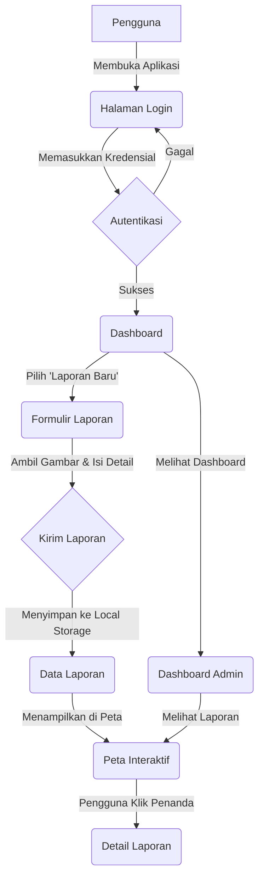

# Jalan Blambangan ku

## Tentang Proyek Ini

**Jalan Blambangan ku** adalah aplikasi web yang dirancang untuk melaporkan dan mengelola kerusakan jalan di suatu wilayah. Pengguna dapat mengirimkan laporan kerusakan jalan lengkap dengan foto dan data koordinat. Laporan ini kemudian ditampilkan di peta interaktif, memudahkan pemantauan dan penanganan oleh pihak berwenang.

Aplikasi ini memiliki fitur autentikasi untuk membedakan peran pengguna (User, Admin, Surveyor), dashboard yang disesuaikan untuk setiap peran, dan sistem geocoding canggih untuk memastikan akurasi lokasi laporan.

## Flowchart Aplikasi

## Perkembangan Proyek

Berikut adalah status pengembangan fitur-fitur utama dalam aplikasi:

- [x] **Pelaporan Kerusakan Jalan**: Pengguna dapat melaporkan kerusakan dengan foto, deskripsi, dan lokasi.
- [x] **Peta Interaktif**: Menampilkan semua laporan di peta menggunakan Leaflet & OpenStreetMap.
- [x] **Tampilan Detail Laporan**: Panel detail menampilkan informasi lengkap, histori, dan status perbaikan.
- [x] **Sistem Login**: Autentikasi untuk peran User, Admin, dan Surveyor.
- [x] **Dashboard Admin**: Visualisasi data, manajemen laporan, dan pengelolaan surveyor.
- [x] **Dashboard Pengguna**: Membuat laporan dan memberikan feedback.
- [x] **Sistem Geocoding**: Sistem canggih dengan multi-provider (Overpass & Nominatim), cache, dan fallback untuk akurasi nama jalan.
- [x] **Dokumentasi & Troubleshooting**: Dokumentasi internal yang lengkap dan panduan pemecahan masalah deployment.
- [ ] Penilaian kerusakan berbasis AI.
- [ ] Fitur rating dan feedback lanjutan dari pengguna.
- [ ] Dukungan mode offline.
- [ ] Persistensi data (migrasi dari localStorage ke Firebase/Supabase).
- [ ] Notifikasi push untuk update status laporan.
- [ ] Ekspor data laporan (CSV/PDF).
- [ ] Pengujian unit dan integrasi.
- [ ] Pipeline CI/CD untuk otomatisasi deployment.